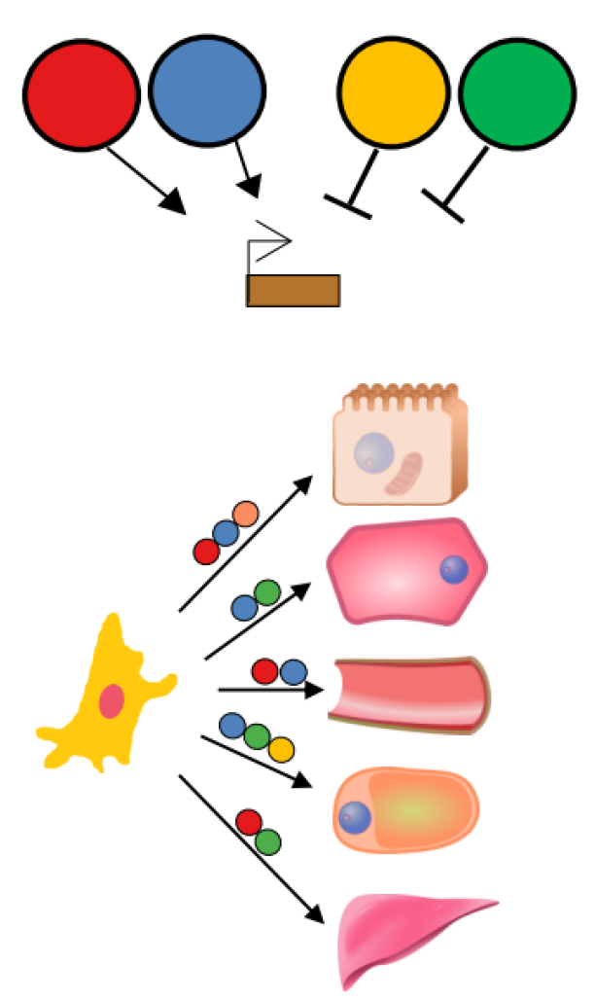

## **Transcription factor motif biases calculator**

### Motivation
---------------------------------------------------------
- Comparison of gene programs between cell types is necessary for making decisions on Transcription Factors (TFs) useful for conversions.
- Design and selection of gene sets for this propuse can be automated considering heuristics, such as top-N up-regulated genes.
- Comparison of gene groups should consider between different cell lineages and redundancy between gene sets.

### Solution
----------------

This Python workflow:
1. Calculates motif biases (log2FC and Z-scores) between two cell types of interest, using top-N genes and TF motifs for TF-gene associations.
2. Summarizes values as a table, for downstream analyses


### Workflow steps
1. Expression values are obtained an normalized into Z-scores from a expression resource (e.g. TabulaMuris)
2. Z-scores also preparing sets of N genes (e.g. 1000) for each cell type.
3. Using pre-annotated motifs (from CIS-BP) cell type pairs are compared based on this metric.
4. For each comparison, a log2FC is reported.

### Installation and running (typical time: less than 5 minutes)

1. Clone repository.
```
git clone gimme_motif_bias.git
cd gimme_motif_bias
```
2. Motif hits CIS-BP (mouse genome) (~1GB).
    - download the following file and uncompress it in `input`
[Motif hits mm10 (Dropbox)](https://www.dropbox.com/s/krqpe8lluw4otma/motif_hits_cisbp_build_1.94d_mm10.zip?dl=0)

### Environment requirements
- `Python 3` https://www.python.org/
- Data Science packages for Python: `pandas numpy`
- `MyGene` (for ENSEMBL IDs conversion steps).
    - [website](http://docs.mygene.info/projects/mygene-py/en/latest/)
    - [Conda Installation](https://anaconda.org/bioconda/mygene)
    - [Pip](https://pypi.org/project/mygene/)
- `rypy` (optional) # it can be skipped by running with the flag '--skippadj'

### Execution examples
```
# 1 vs 1
python gimme_motif_bias.py --listont # list all available ontologies and finish
python gimme_motif_bias.py --listmotifs ASCL1 # list all motifs related to ASCL1
python gimme_motif_bias.py -a "neuron" -b "hepatocyte" --motifid M08474_1.94d
```

### Output
- A TSV table with the respective effect sizes, p-values, in long format `see output/a_b_cell_type_motif.txt`
- Excel table in similar format.

### Running time
- Around 1-2 minutes for one pair.
- 20-40 minutes for full execution betwee a-b and multiple TFs (one CPU, default parameters, verification against other genomes and
RNA secondary structure assessment).
- Adding more cell types increases quadratically running time quadratically.
- Increasing the number of motifs increases linearly the running time.

### Misc
- Custom cell types and gene sets can be added manually in `input/genes_by_ont` as fasta list.
- You can add any custom set of hits of your interest in `motif_hits_cisbp_build_1.94d_mm10`.

### Feedback, errors, or further questions
- Report in Issues.
- e-mail to Ignacio Ibarra (ignacio.ibarra@helmholtz-muenchen.de).